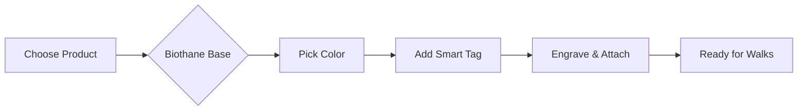

## Overview

Nexapaw delivers premium dog accessories designed for durability, comfort, and style. You get leashes, collars, and harnesses made from Biothane material, which stays odor-free, repels water, and wipes clean effortlessly. Add smart ID tags for safety, and customize everything to match your dog's personality. These features make walks enjoyable and worry-free.

<Columns cols={2}>
  <Card title="Durable Biothane" icon="shield" href="#biothane-benefits">
    Tough against chewers and weather.
  </Card>
  <Card title="Smart Tracking" icon="map-pin" href="#smart-id-tags">
    Locate your dog instantly.
  </Card>
  <Card title="Custom Styles" icon="palette" href="#customization">
    Colors and patterns for every pup.
  </Card>
  <Card title="Comfort Fit" icon="heart" href="#product-overviews">
    Adjustable for all breeds and sizes.
  </Card>
</Columns>

## Biothane Material Benefits

Biothane sets Nexapaw products apart. This patented material mimics leather's look but outperforms it in real-world use.

<Callout kind="tip">
  Unlike nylon that absorbs odors or leather that cracks when wet, Biothane wipes clean with soap and water. It resists mildew, bacteria, and wear from daily adventures.
</Callout>

Key advantages include:

| Feature          | Benefit                          |
|------------------|----------------------------------|
| Waterproof       | No swelling or weakening in rain |
| Odor-Resistant   | Stays fresh after muddy walks    |
| Easy to Clean    | Hose off dirt in seconds         |
| Hypoallergenic   | Safe for sensitive skin          |
| Lifetime Warranty| Built to last with your dog      |

You save time on maintenance and enjoy gear that looks new longer.

## Product Overviews

Nexapaw offers three core categories: leashes, collars, and harnesses. Each uses Biothane for reliability.

<Tabs>
  <Tab title="Leashes" icon="link">
    Choose from 4-6 foot lengths with traffic handles for control. Reflective stitching ensures visibility at night. Perfect for training or casual strolls.
  </Tab>
  <Tab title="Collars" icon="circle">
    Quick-release buckles prevent accidents. Martingale style tightens gently to deter pullers. Sizes fit from Chihuahuas to Great Danes.
  </Tab>
  <Tab title="Harnesses" icon="package">
    No-pull designs distribute pressure across chest. Step-in style for easy on/off. Ideal for reactive dogs or long hikes.
  </Tab>
</Tabs>

<Image
  src="https://via.placeholder.com/800x400/345bee/ffffff?text=Nexapaw+Harness"
  alt="Nexapaw Biothane harness on a dog during a walk"
  width="800"
  height="400"
/>

## Smart ID Tags

Enhance safety with Nexapaw's smart ID tags. These QR-code tags link to your contact info and your dog's medical details.

<Steps>
  <Step title="Attach Tag" icon="link">
    Snap the lightweight tag onto any collar or harness.
  </Step>
  <Step title="Scan & Register" icon="smartphone">
    Use your phone to scan the QR code and enter details via the Nexapaw app.
  </Step>
  <Step title="Update Anytime" icon="edit">
    Edit info remotely if your contact changes.
  </Step>
</Steps>

<Callout kind="alert">
  In emergencies, rescuers scan the tag to reach you instantly—no phone needed on the dog.
</Callout>

## Customization Options and Styling Tips

Tailor your gear to fit your style.

<ExpandableGroup>
  <Expandable title="Color Choices" default-open="true">
    Select from 10+ Biothane colors like neon green, camo, or pastel pink. Mix and match for a custom set.
  </Expandable>
  <Expandable title="Engraving" default-open="false">
    Laser-engrave your dog's name or phone number directly on the hardware for added personalization.
  </Expandable>
  <Expandable title="Styling Tips">
    Pair bright leashes with neutral collars for balance. Use patterns for fun breeds like Labs, solids for sleek ones like Greyhounds.
  </Expandable>
</ExpandableGroup>

Match your dog's energy: vibrant for playful pups, subtle for calm companions. With these features, Nexapaw equips you for every adventure.